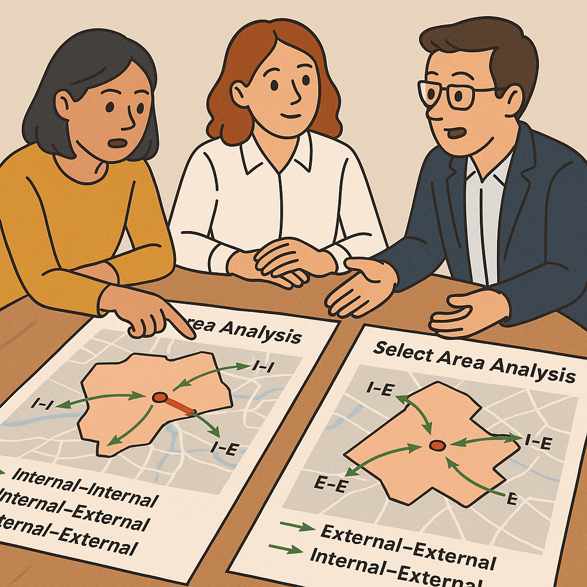
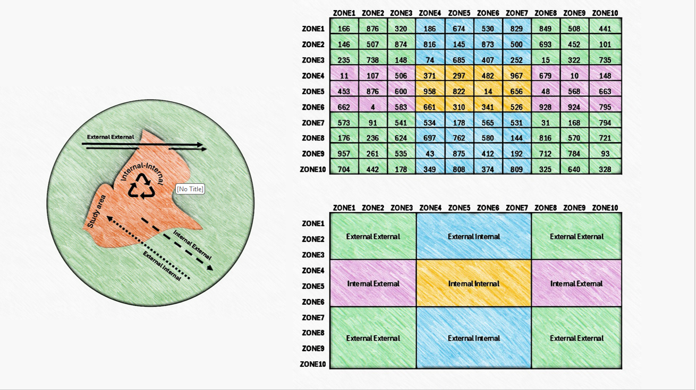

# INEXDO

Sub area analysis of transport modeling is a method used to evaluate and understand the travel patterns and behaviors within a specific geographic area or zone. This type of analysis is crucial for urban planners, transportation engineers, and policymakers to make informed decisions about infrastructure development, traffic management, and public transportation services. A select-area analysis or a sub-area analysis typically involves the following steps:

1.  **Data Collection**: Gather data on travel patterns, including origin-destination matrices, traffic counts, public transportation usage, and demographic information.

2.  Cut a small portion of the model area, a sub-area, for detailed analysis. This can be done by selecting specific zones or regions within the larger model.

3.  **Analysis**: Analyze the results of the model to identify key travel patterns, congestion points, and areas of high demand for transportation services. This involves internal-internal, internal-external and external-external trips.

{fig-align="center" width="400"}

## Purpose

INEXDO is voor al het inkomend, uitgaand en doorgaand verkeer door een of meerdere zones.



## Inputs

-   `Zone number(s)` : the zones you want to use
-   `Matrix location`

## Outputs

Following are the outputs to this job.

## Code

``` ruby
Zone = [1,2,3,4]+[5,6,7,8]
```
